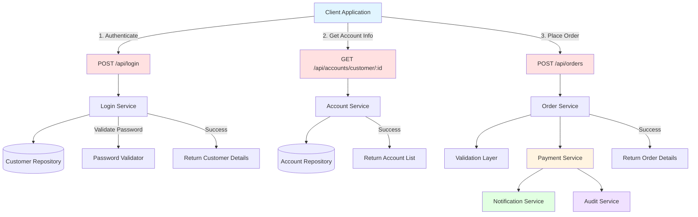
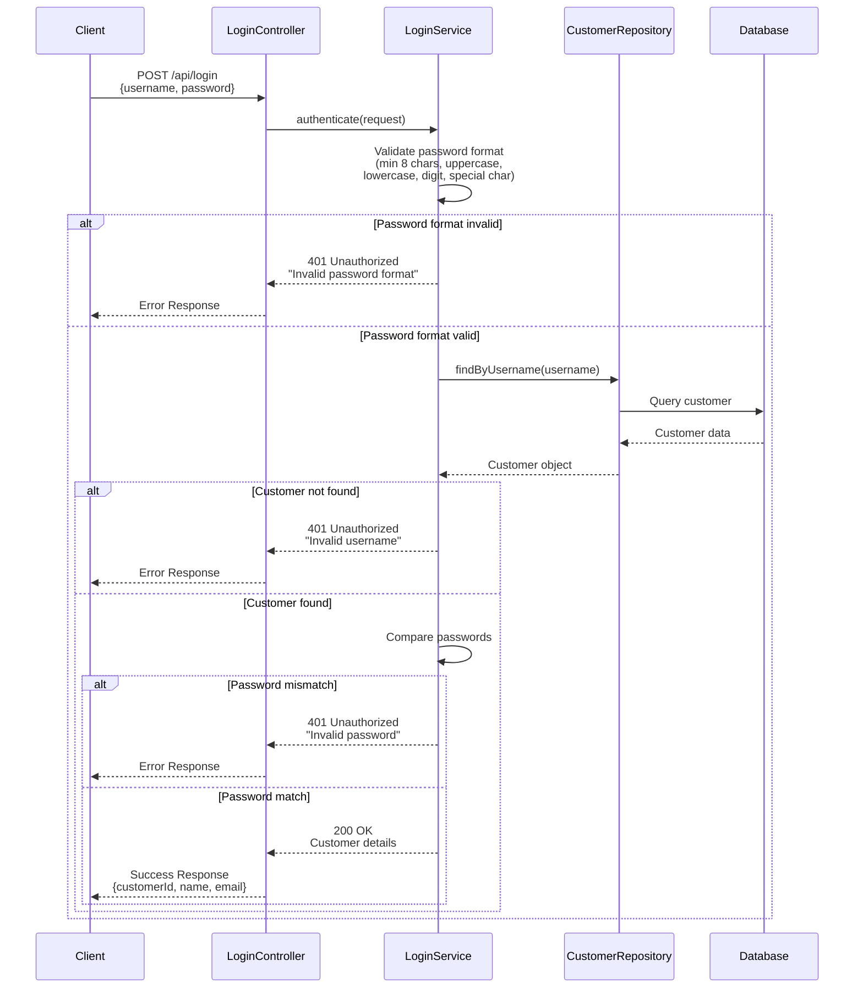
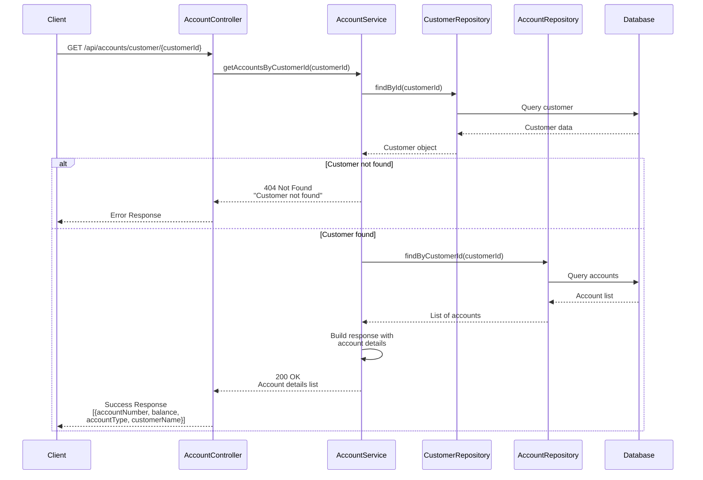
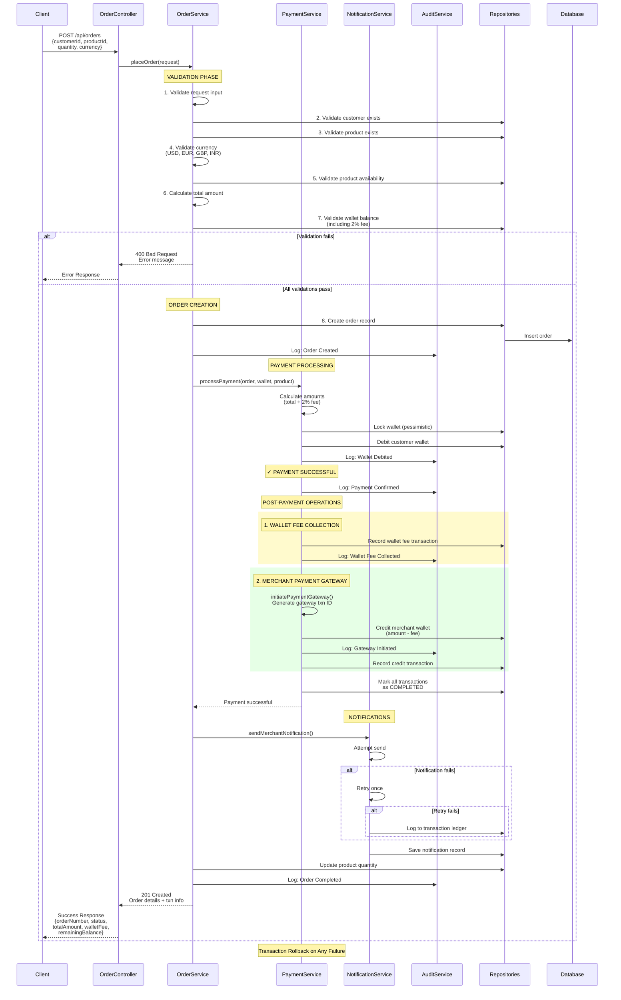
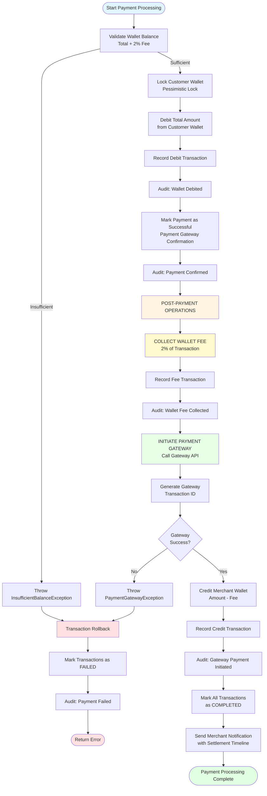
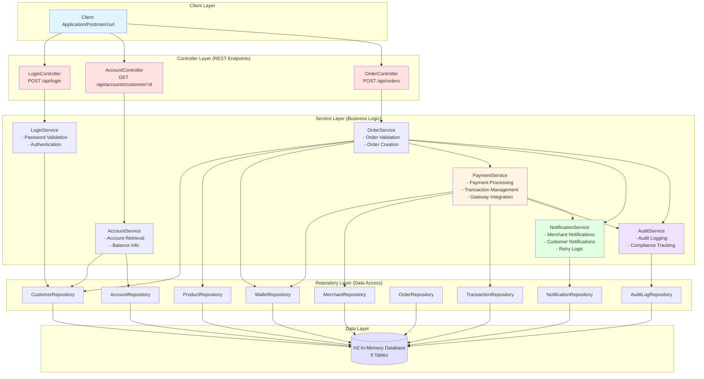
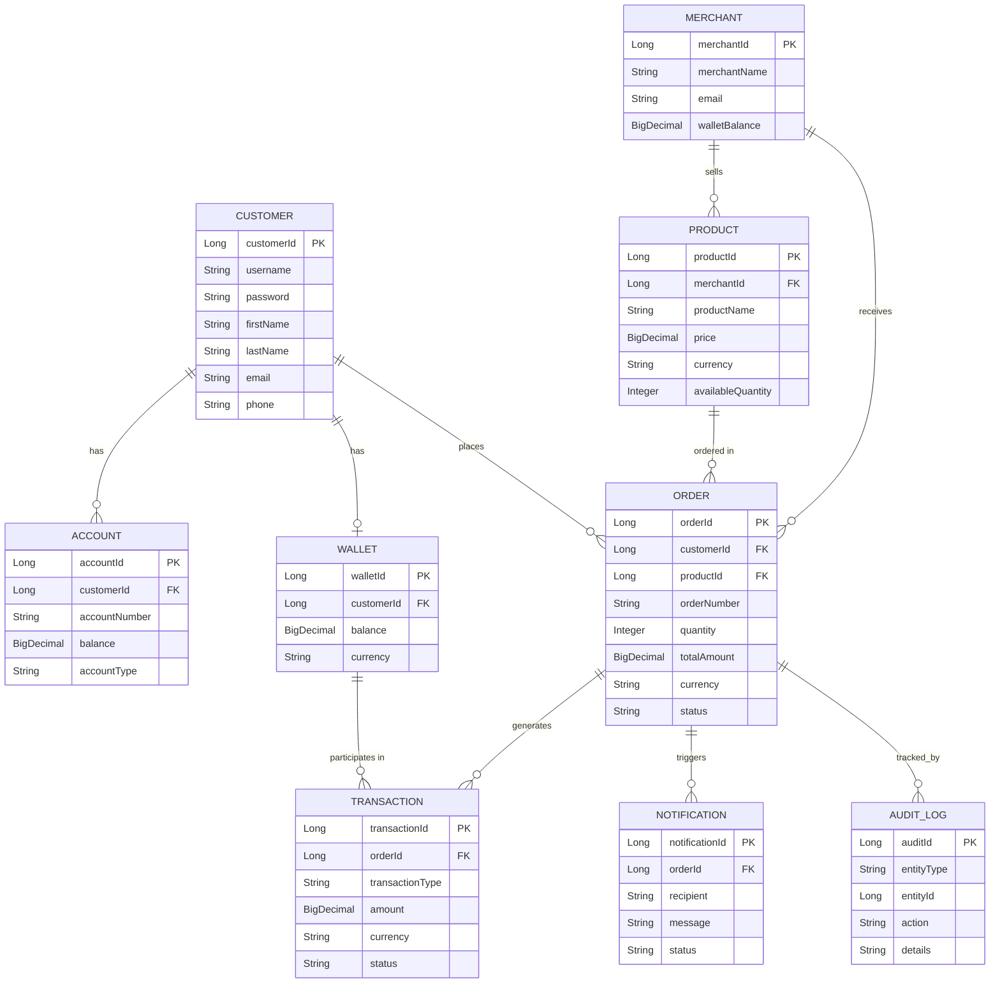
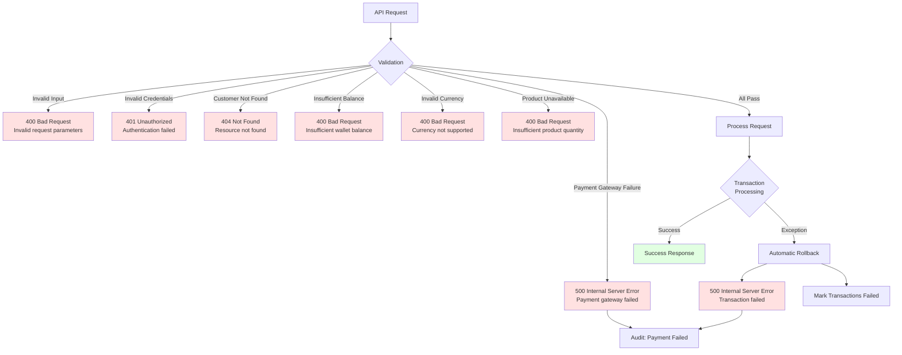

# E-Commerce Backend Platform - API Flow Diagrams

This document contains comprehensive flow diagrams for all APIs in the application.

## Overview Flow Diagram

## 1. Login Service Flow

## 2. Account Service Flow

## 3. Order & Payment Service Flow

## 4. Payment Service Transaction Flow (Detailed)

## 5. System Architecture Flow

## 6. Data Model Relationships

## 7. Error Handling Flow

## API Endpoints Summary

| API | Method | Endpoint                              | Description |
|-----|--------|---------------------------------------|-------------|
| Login Service | POST | `/api/login`                          | Authenticate user with username/password |
| Account Service | GET | `/api/accounts/customer/{customerId}` | Get account details for a customer |
| Order Service | POST | `/api/placeOrder`                    | Place an order with payment processing |

## Key Features Illustrated in Diagrams

1. **Authentication Flow**: Password validation with format requirements
2. **Account Retrieval**: Multi-account support per customer
3. **Order Processing**: Complete validation chain before payment
4. **Payment Flow**: Atomic transaction with rollback capability
5. **Post-Payment Operations**: 
   - Wallet fee collection (2%)
   - Payment gateway integration for merchant transfer
6. **Notification System**: Retry mechanism with ledger logging
7. **Audit Trail**: Complete tracking of all operations
8. **Error Handling**: Comprehensive error responses with proper HTTP codes
9. **Transaction Management**: Pessimistic locking and automatic rollback
10. **Data Integrity**: Proper entity relationships and foreign keys

## Technologies Used

- **Spring Boot** - Application framework
- **Spring Data JPA** - Data persistence
- **H2 Database** - In-memory database
- **Spring Transactions** - Transaction management
- **Mockito & JUnit 5** - Testing framework
